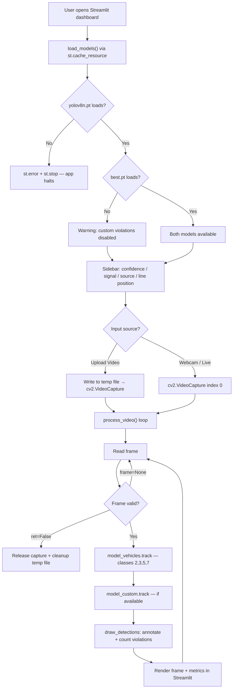

# Traffic Violation Detection System

A dual-model computer vision application that detects traffic violations in real time using YOLOv8 object tracking and a Streamlit dashboard. The system enforces red-light stop-line compliance for vehicles and independently flags behavioral infractions such as riding without a helmet, triple riding, mobile phone usage, and wheeling.

---

## Table of Contents

- [Project Overview](#project-overview)
- [Architecture Overview](#architecture-overview)
- [System Flow](#system-flow)
- [Core Modules](#core-modules)
- [Data Model](#data-model)
- [Detection Classes](#detection-classes)
- [Training Pipeline](#training-pipeline)
- [Setup & Installation](#setup--installation)
- [Running the Application](#running-the-application)
- [Testing](#testing)
- [Limitations](#limitations)
- [Project Structure](#project-structure)
- [License](#license)

---

## Project Overview

This system addresses two categories of traffic violations through a single Streamlit-based interface:

| Category | Detection Method | Model | Trigger Condition |
|---|---|---|---|
| **Red-light crossing** | Vehicle tracking + stop-line comparison | `yolov8n.pt` (YOLOv8 Nano, pretrained COCO) | Vehicle's bottom edge (`y2`) crosses the stop line while the signal is set to RED |
| **Behavioral violations** | Custom object detection | `best.pt` (fine-tuned YOLOv8 Large) | Detection of violation class in any frame, regardless of signal state |

The application accepts video uploads (`mp4`, `avi`) or webcam input and produces annotated frames with bounding boxes, violation labels, and a running violation counter.

---

## Architecture Overview

The project consists of three independent Python modules with no shared backend:

```
┌─────────────────┐     ┌─────────────────┐     ┌─────────────────────┐
│ download_data.py │     │    train.py      │     │       app.py        │
│                  │     │                  │     │                     │
│  Roboflow API    │────▶│  YOLOv8l fine-   │────▶│  Streamlit UI +     │
│  dataset pull    │     │  tuning on       │     │  dual-model         │
│  (TVD-2/)        │     │  TVD-2/data.yaml │     │  real-time inference│
└─────────────────┘     └─────────────────┘     └─────────────────────┘
      Phase 1                 Phase 2                  Phase 3
```

| Module | Role | Entry Point |
|---|---|---|
| `download_data.py` | Downloads the annotated dataset from Roboflow in YOLOv8 format | `python download_data.py` |
| `train.py` | Fine-tunes YOLOv8 Large on the downloaded dataset; copies `best.pt` to project root | `python train.py` |
| `app.py` | Streamlit dashboard performing dual-model inference on video input | `streamlit run app.py` |

---

## System Flow



### Frame-Level Processing Detail

For each valid frame, two tracking passes execute sequentially:

1. **Vehicle tracking** (`model_vehicles.track`) — filters to COCO classes `[2, 3, 5, 7]` (car, motorcycle, bus, truck). Results are passed to `draw_detections` with `is_custom_violation=False`. A violation is recorded only if the signal is RED **and** the bottom edge of the bounding box (`y2`) exceeds the stop-line Y coordinate.

2. **Custom violation tracking** (`model_custom.track`) — runs only if `best.pt` loaded successfully. Results are passed to `draw_detections` with `is_custom_violation=True`. Every detection is treated as a violation regardless of signal state.

Each tracked object receives a unique ID (`v_{track_id}` for vehicles, `c_{track_id}` for custom violations) stored in a `violated_ids` set, preventing the same object from being counted more than once per session.

---

## Core Modules

### `app.py` — Streamlit Dashboard

#### `load_models() → tuple[YOLO | None, YOLO | None]`

Decorated with `@st.cache_resource`. Loads two YOLO models:

| Model | File | Required | Failure Behavior |
|---|---|---|---|
| Vehicle detector | `yolov8n.pt` | Yes | Returns `(None, None)` → `st.stop()` halts the app |
| Custom violation detector | `best.pt` | No | Returns `(model_vehicles, None)` → app continues without custom classes |

#### `process_video(cap: cv2.VideoCapture, line_pos_percent: float) → None`

Main inference loop. Reads frames from `cap`, runs both tracking models, draws annotations, and updates Streamlit placeholders. Key behaviors:

- Validates frame dimensions; exits with `st.error` if `width ≤ 0` or `height ≤ 0`.
- Skips `None` frames without crashing.
- Releases the capture handle in a `finally` block.
- Computes stop-line Y position as `int(height * line_pos_percent)`.

#### `draw_detections(frame, results, is_custom_violation: bool) → None`

Nested function inside `process_video`. Iterates over tracked boxes and:

- Skips the result entirely if `results.boxes.id is None` (no tracked objects).
- For custom violations (`is_custom_violation=True`): labels the detection as the class name in uppercase, always marks it as a violation.
- For vehicle detections (`is_custom_violation=False`): marks as `"RED LIGHT"` violation only if `is_red=True` and `y2 > line_y`.
- Deduplicates via `uid` in the `violated_ids` set.

#### Sidebar Controls

| Control | Widget | Default | Range |
|---|---|---|---|
| Detection Confidence | `st.sidebar.slider` | `0.35` | `0.0` – `1.0` |
| Traffic Signal | `st.sidebar.radio` | `RED 🔴` | `GREEN 🟢` / `RED 🔴` |
| Input Source | `st.sidebar.radio` | `Upload Video` | `Upload Video` / `Webcam / Live` |
| Line Position | `st.sidebar.slider` | `0.6` | `0.1` – `0.9` |

---

### `train.py` — Training Pipeline

#### `train_model() → bool`

Trains YOLOv8 Large (`yolov8l.pt`) on the dataset defined in `TVD-2/data.yaml`.

| Parameter | Value | Source |
|---|---|---|
| `epochs` | `50` | Hardcoded |
| `imgsz` | `640` | Hardcoded |
| `batch` | `8` | Hardcoded (sized for 8 GB VRAM) |
| `amp` | `True` | Hardcoded |
| `seed` | `42` | Hardcoded |
| `device` | `0` if CUDA available, else `"cpu"` | `torch.cuda.is_available()` |
| `project` | `<project_root>/runs/train` | Computed from `__file__` |
| `name` | `traffic_violation_large` | Hardcoded |

Returns `True` on success, `False` if the dataset YAML is missing or training throws an exception. On success, copies `runs/train/traffic_violation_large/weights/best.pt` to `<project_root>/best.pt`.

**Exit code contract**: `__main__` block calls `raise SystemExit(0 if train_model() else 1)`.

---

### `download_data.py` — Dataset Ingestion

#### `download_dataset() → None`

Downloads version 2 of the `tvd-kp9qw` project from the `traffic-violation-detection` Roboflow workspace in YOLOv8 format.

**API key resolution order**:

1. `ROBOFLOW_API_KEY` environment variable.
2. Interactive `input()` prompt — only if `sys.stdin.isatty()` returns `True`.
3. If neither is available, calls `sys.exit(1)`.

On any Roboflow client exception, prints the error and calls `sys.exit(1)`.

---

## Data Model

### Dataset Configuration (`TVD-2/data.yaml`)

```yaml
names:
  - No helmet
  - Triple riding
  - Using mobile
  - Wheeling
nc: 4
train: train/images
val: valid/images
test: test/images
```

Paths are relative to the YAML file's directory (`TVD-2/`).

### Runtime State (within `process_video`)

| Variable | Type | Purpose |
|---|---|---|
| `total_violations` | `int` | Running count of unique violations in the session |
| `violated_ids` | `set[str]` | Tracks `"v_{id}"` / `"c_{id}"` strings to prevent double-counting |
| `line_y` | `int` | Pixel Y coordinate of the stop line, computed from `height * line_pos_percent` |
| `is_red` | `bool` | Module-level variable set from the sidebar radio selection |
| `confidence` | `float` | Module-level variable from the sidebar slider, passed to `.track(conf=...)` |

---

## Detection Classes

### Vehicle Model (`yolov8n.pt`) — COCO Subset

| COCO Class ID | Label |
|---|---|
| 2 | Car |
| 3 | Motorcycle |
| 5 | Bus |
| 7 | Truck |

Filtered via `classes=[2, 3, 5, 7]` in the `.track()` call.

### Custom Violation Model (`best.pt`) — Fine-tuned

| Class ID | Label |
|---|---|
| 0 | No helmet |
| 1 | Triple riding |
| 2 | Using mobile |
| 3 | Wheeling |

---

## Training Pipeline

The full pipeline from raw data to a trained model:

```
1. Set ROBOFLOW_API_KEY    →  export ROBOFLOW_API_KEY="your_key"
2. Download dataset         →  python download_data.py        → TVD-2/
3. Train model              →  python train.py                → best.pt
4. Run application          →  streamlit run app.py
```

### Training Output

Artifacts are saved to `runs/train/traffic_violation_large/`:

- `weights/best.pt` — best checkpoint (auto-copied to project root)
- `weights/last.pt` — final epoch checkpoint
- Plots: confusion matrix, label distributions, training curves (enabled via `plots=True`)

---

## Setup & Installation

### Prerequisites

- Python 3.8+
- NVIDIA GPU with CUDA support (optional — CPU inference and training are supported)

### 1. Clone the Repository

```bash
git clone https://github.com/pypi-ahmad/Traffic-Signal-Violation-Detection.git
cd Traffic-Signal-Violation-Detection
```

### 2. Create a Virtual Environment

```bash
# Windows
python -m venv .env
.env\Scripts\activate

# Linux / macOS
python3 -m venv .env
source .env/bin/activate
```

### 3. Install Dependencies

```bash
pip install -r requirements.txt
```

**Dependencies** (`requirements.txt`):

| Package | Purpose |
|---|---|
| `torch` | PyTorch backend for model inference and training |
| `torchvision` | Image transforms and utilities |
| `ultralytics` | YOLOv8 model loading, training, and tracking |
| `roboflow` | Dataset download client |
| `opencv-python` | Video capture, frame manipulation, drawing |
| `numpy` | Numerical operations on detection tensors |
| `streamlit` | Web dashboard UI |
| `pytest` | Test framework |

---

## Running the Application

### Quickstart (Inference Only)

If `yolov8n.pt` is already present (auto-downloaded by Ultralytics on first run) and `best.pt` is available:

```bash
streamlit run app.py
```

The dashboard opens in the default browser. Use the sidebar to:

1. Select an input source (upload a `.mp4`/`.avi` file, or start the webcam).
2. Set the traffic signal to RED or GREEN.
3. Adjust the detection confidence threshold.
4. Position the stop line using the slider.
5. Click **Start Analysis** or **Start Live Feed**.

### Full Pipeline (From Scratch)

```bash
# Step 1: Download the dataset
export ROBOFLOW_API_KEY="your_key_here"   # or enter interactively
python download_data.py

# Step 2: Train the custom violation model
python train.py

# Step 3: Launch the dashboard
streamlit run app.py
```

---

## Testing

The test suite uses **pytest** with monkeypatched fakes for Streamlit, OpenCV, and Ultralytics to enable fully offline, deterministic testing.

### Run All Tests

```bash
pytest -v
```

### Test Categories

| Category | Directory | Tests | Coverage |
|---|---|---|---|
| Unit | `tests/unit/` | 7 | Model loading, video processing, training args, download paths |
| Integration | `tests/integration/` | 4 | End-to-end pipeline, inference flow, training artifact copy |
| ML Validation | `tests/ml/` | 3 | Model initialization, tensor shapes, missing tracking IDs |
| Edge Cases | `tests/edge/` | 4 | Missing weights, Roboflow errors, empty video, invalid dimensions |
| **Total** | | **23** | |

### Shared Test Infrastructure (`tests/conftest.py`)

All tests run against fake implementations to avoid loading real models or launching Streamlit:

| Fake | Replaces | Purpose |
|---|---|---|
| `FakeModel` | `ultralytics.YOLO` | Returns preconfigured detection results |
| `FakeVideoCapture` | `cv2.VideoCapture` | Yields a fixed sequence of frames |
| `FakeStreamlitModule` | `streamlit` | Captures UI calls (metrics, images, errors) |
| `FakeCv2Module` | `cv2` | No-ops for drawing functions |

---

## Limitations

The following constraints exist in the current implementation:

1. **No persistent storage.** Violation counts and events exist only in the Streamlit session. Closing the browser tab discards all data.

2. **Single-threaded frame loop.** `process_video` reads and processes frames sequentially in a `while` loop. There is no frame buffering, async processing, or GPU batching across frames.

3. **Static signal state.** The traffic light toggle (`is_red`) is read once at module level from the sidebar radio. Changing the toggle during an active video session has no effect until the script re-runs.

4. **No authentication or access control.** The Streamlit app has no login mechanism. Anyone with network access to the server port can use it.

5. **Uploaded video fully buffered to disk.** `uploaded_file.read()` loads the entire file into memory before writing to a temp file. Very large files may cause memory pressure.

6. **Unpinned dependencies.** All packages in `requirements.txt` are unpinned. A breaking change in any upstream package could affect fresh installs.

7. **Stop-line position is manual.** The line position is set via a slider; there is no automatic detection of road markings.

8. **No violation export.** Detected violations are displayed on-screen only. There is no CSV, database, or API export mechanism.

---

## Project Structure

```
Traffic-Signal-Violation-Detection/
├── app.py                 # Streamlit dashboard — dual-model inference
├── train.py               # YOLOv8l fine-tuning pipeline
├── download_data.py       # Roboflow dataset downloader
├── requirements.txt       # Python dependencies
├── best.pt                # Custom violation model (training output)
├── yolov8l.pt             # YOLOv8 Large (training base model)
├── yolov8n.pt             # YOLOv8 Nano (vehicle detection at runtime)
├── TVD-2/                 # Dataset directory
│   ├── data.yaml          # Class names + split paths
│   ├── train/images/      # Training images
│   ├── valid/images/      # Validation images
│   └── test/images/       # Test images
├── tests/                 # Automated test suite (23 tests)
│   ├── conftest.py        # Shared fakes and fixtures
│   ├── unit/              # Unit tests for each module
│   ├── integration/       # Pipeline integration tests
│   ├── ml/                # Model loading and prediction tests
│   └── edge/              # Edge case and failure mode tests
├── TEST_REPORT.md         # Audit report with findings and fixes
├── README.md              # This file
└── .gitignore             # Git ignore rules
```

---

## License

No `LICENSE` file is currently present in this repository.
